# E-Voting System using C++

The goal of this project is to create an electronic voting system that efficiently handles and manages voting, candidate, and voter data. The method guarantees a simple, paperless voting process that requires less human involvement and makes polls easily accessible. Regular users can quickly cast their ballots, and it has an admin-only interface for safe data modification.

Key Features

+ :white_check_mark:User-Friendly Interface: Simplified voting process with easy access to polls.

+ :white_check_mark:Admin Control: Only the admin can manipulate voter, candidate, and poll data, ensuring security.

+ :white_check_mark:Efficient Data Management: Store and update voter, candidate, and poll data seamlessly.

  
# OOP's Concepts Utilized

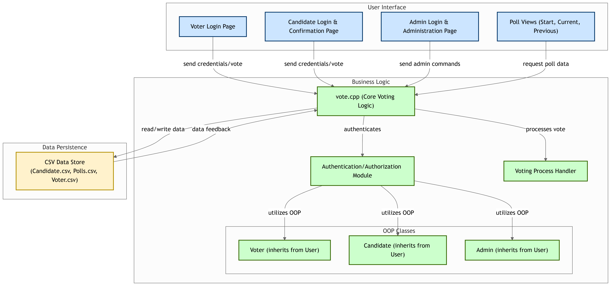

# OOP's Concepts Utilized

1.Inheritance: Different classes for voter, candidate, etc., with data objects accessed by the admin class using inheritance.

2.Polymorphism: Implemented through function overloading, function overriding, and operator overloading.

3.Abstract Classes and Virtual Functions: Used to simplify and clarify the code with different definitions for functions in different classes.

4.Friend Functions: Provide private class information (e.g., admin username and password) to functions that require these values.

5.Constructors and Destructors: Initialize data values and remove objects after necessary changes.

6.File Handling: Store candidate, voter, and poll data, and save poll results for future access.


## Screenshots

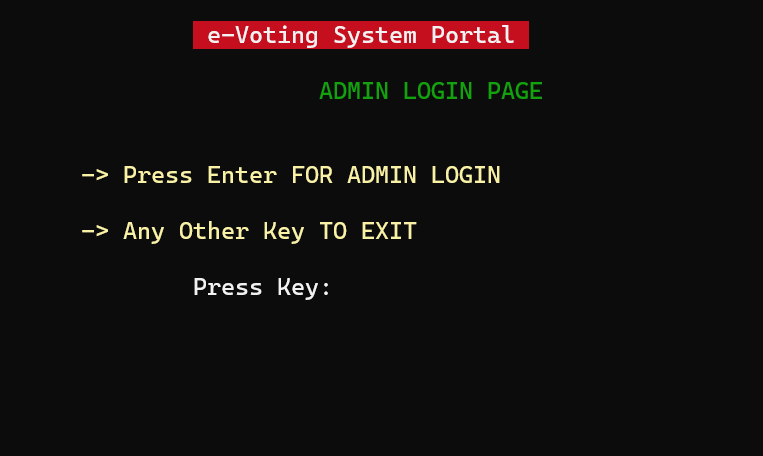

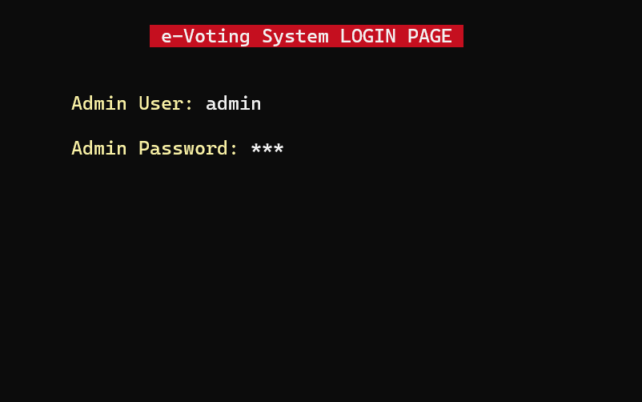

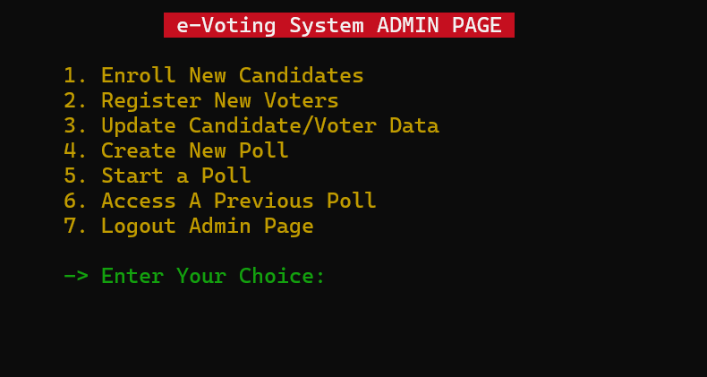

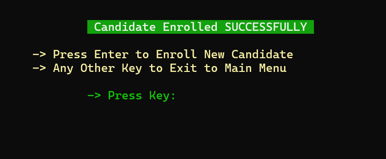

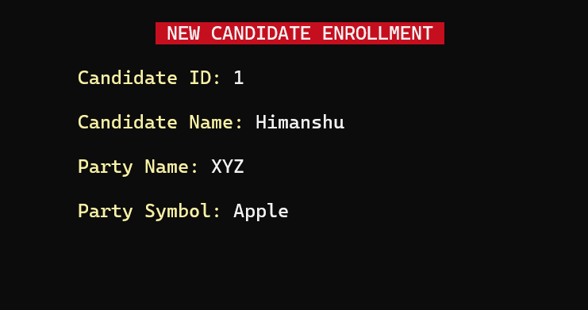

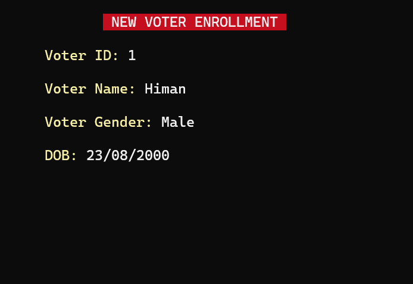

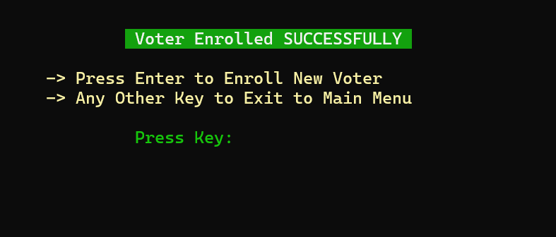

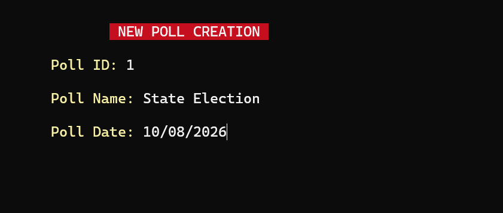

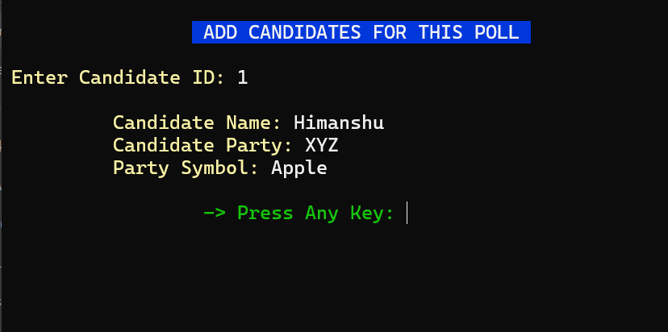

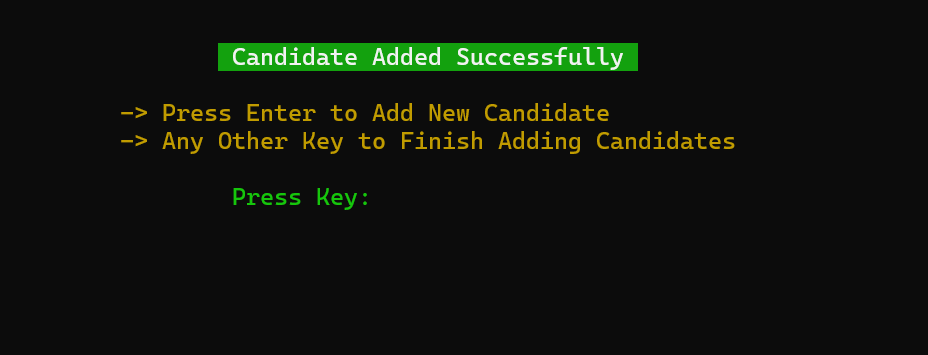

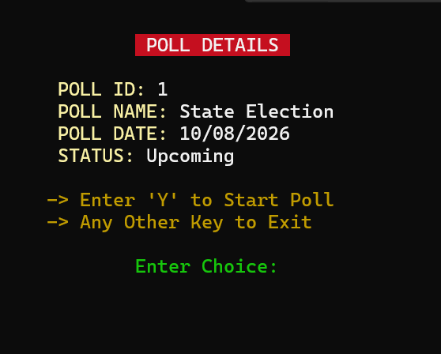

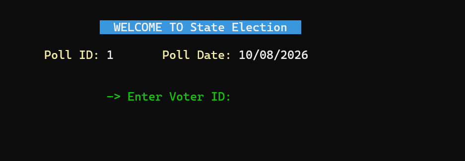

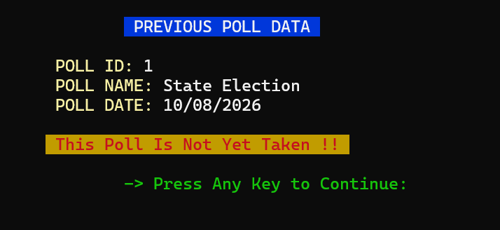


## Supported Platform

+ Unix-like Operating Systems (Linux, MacOS, FreeBSD, ...)
+ Windows x86/x64 (MSVC, MinGW, MinGW-w64, Cygwin, ...)
  

## Supported Compiler

MSVC, GCC and Clang, etc. supporting **C++17 standard or above**.

## Clone this Repository

Run:

```shell
https://github.com/himanshukumar8/e-Voting-System.git
```


